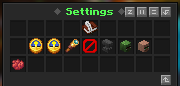
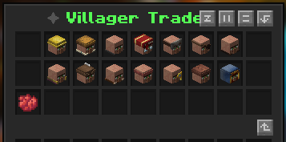

# :material-layers-triple: GUI

## Main GUI

{ loading=lazy }
??? tip "Buttons"
    Villager Trades - View all villager types and edit them!  
    Settings - View all Villagers settings

??? tip "How to open?"
    Opens with **/trademanager** command.

## Settings

{ loading=lazy }

??? tip "Buttons"
    Villager Stock Reset Timer  
    Restricted Trading Hours  
    ??? warning "Prevent Trade Windows"
        Prevent Trade Windows **only applies for Restricted Trading Hours**
    Display Disabled Items  
    Only Display Custom Trades  
    !!! info "Premium **ONLY**"
        Disable Zombie Villagers  
        Disable Villager Rerolling
        
        [Get Premium](https://www.spigotmc.org/resources/trademanagerplus-1-20-x-1-21-5-villager-trade-control-custom-item-support.122864/)

## Villager Trades

{ loading=lazy }

Shows All types of villagers, including **Wandering Trader**.  
